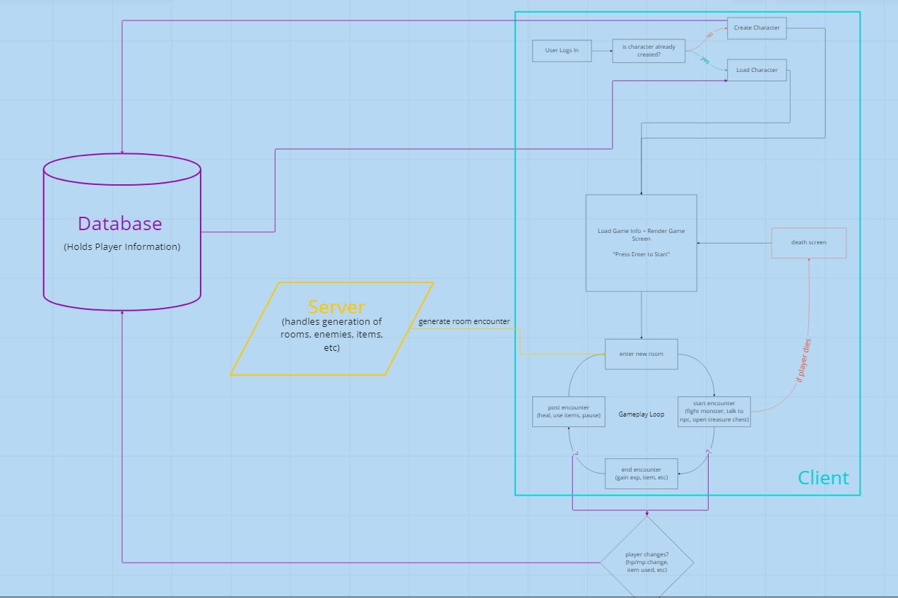
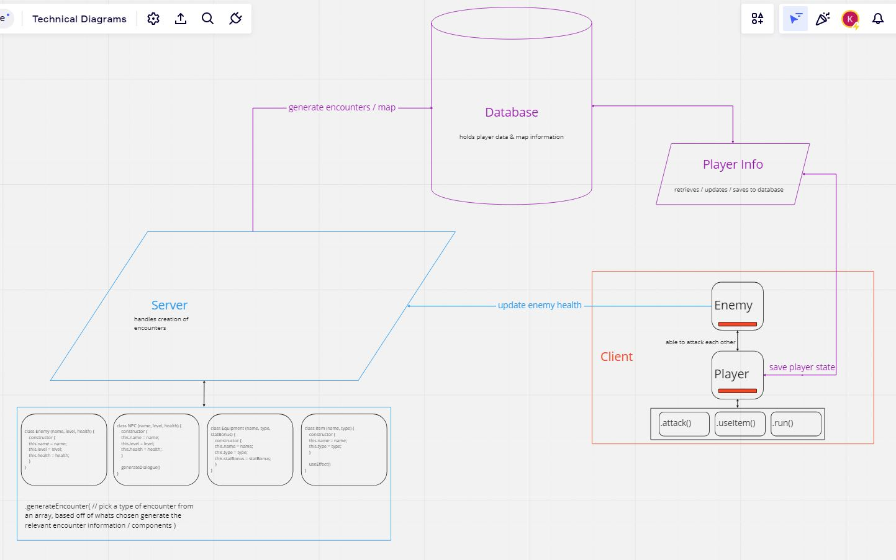
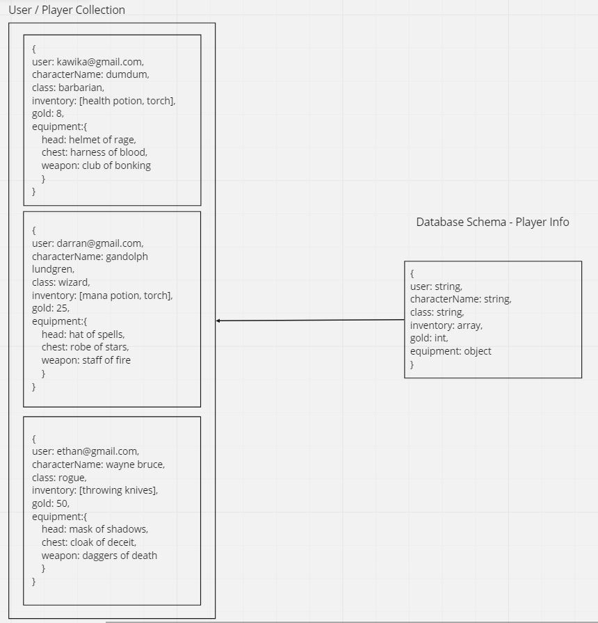

# Software Requirements

## Vision

## What is the vision of this product?

This app will be a modernization of a text-based rpg - it will be heavily reliant on text elements but also include some react-bootstrap components in order to help visualize certain aspects. We want to include some level of randomization / rouge-like elements so that every playthrough is a little different and in that way it keeps things fresh. The user/player will be able to traverse a randomized set of rooms, collect items, battle enemies, level-up and conquer a scaling level of challenge.

### What pain point does this project solve?

A lot of modern games are built with deep, complex, mechanics that can be overwhelming for a lot of people who want something casual that's still fun and engaging. We want to make something that is entertaining and interactive for the user while also maintaining a level of simplicity. This game will be for people who want to enjoy a lighter gaming experience with minimal Mouse & Keyboard coordination.

### Why should we care about your product?

We are ‘modernizing’ text-based while preserving their simple, yet descriptive nature. We are adding visual elements without compromising the text-based game feel. As far as we know, there are no other games that are like this. It’s accessible to a broad audience, can be vertically and horizontally scaled based off of user feedback, and can be played via a web browser or mobile app.

## Scope (In/Out)

### IN - What will your product do

- The user / player will be able to name their character and choose what class they want to play as
- The user will be able to traverse randomly generated rooms that have different encounters (enemies, NPCs/Merchants/ treasure chests/ etc.)
- The user can gain exp, level up, collect items, etc
- Player information will be stored in a database so that the player can load in at any time and continue their journey
- Users will be able to sign in via Auth0
- (Stretch) Multiple players will be able to play together

### OUT - What will your product not do

- The game will never display an overworld map
- The game will never use audio for dialogue or narration

## Minimum Viable Product vs Stretch

### What will your MVP functionality be?

- Be able to create your character and display user / player info
- Be able to enter rooms with randomly generated encounters and fight enemies &/o collect items
- Be able to render / interact with the game via text-based elements &/o react-bootstrap components
- Have a database that handles user profiles & inventories
- Have a component that displays all the console logs (text)

#### What are your stretch goals?

- Be able to player multiplayer
- Log In / Out via Auth0 & tie player characters to their user profiles
- Switch between (Light / Dark / Modern / Retro) themes
- Rouge-like random dungeon generation | Be able to display a map of the possible rooms that you can enter
- If enemies run away, have them maintain their HP in case we encounter them again

## Stretch

### What stretch goals are you going to aim for?

Our stretch goals will aim to accomplish a few things:

- Adding a few more layers of mechanics and complexity to our game
- Adding security / authentication
- Adding personalization / theme options

## Functional Requirements

- Be able to create a player character and link it to their user credentials
- Be able to traverse rooms and interact with the events inside each room
- Be able to attack enemies, use items, talk with NPCs
- Be able to change equipment and browse inventory when not in a battle

## Data Flow

When the user begins using our application they will be prompted to log-in using Auth0. After they are authenticated, they will then have the option to create a character or load an existing one; upon choosing their character they will be dropped into the game screen. The game screen will render the player as a react-bootstrap card and the player will be greeted with an random encounter (enemy battle, npc/merchant, or a treasure chest). The player will need to interact with the encounter by either defeating the enemies, finishing the dialogue with the npc, or opening the chest. From there, the updated player object and its react.component state will be sent to our database so that the most up to date information about the player is always saved. If the player fails to complete the encounter (e.g. dies in battle), a "game over" screen will render to the screen and the player will be taken back to the main menu.

## Non-Functional Requirements (301 & 401 only)

### Security

- Stop people from cheating by only allowing calculations to go through the secure server side. - store data in a secure database and use Auth0 to authenticate users.

### Usability

- User interaction will be clear and straightforward. The game will have a linear development with vertical scalability.

### Testability

- Providing random data is easy and can make for getting a basic frame of the game off the ground. Testing can easily be done by supplying random values generated by the game engine to the client, server, and database respectively.

---

Our project will implement the randomly generated descriptive elements from the game engine into the vision and structure of our game. Our game will turn descriptive text-based movement between rooms into a slightly visualized but mostly descriptive RPG. Thus descriptive elements will remain in the text-based format, though some elements of description will also map to colors, shapes and structure of the components on the page. A room with slime on the walls may have a green border on a component. A tattered skeleton may be displayed as a card component with a dashed border rather than a solid one. Without displaying a ‘game world’ we want to map descriptive elements in the text to visual elements already present and discoverable in the components like borders, colors, and other styles.

The game engine will show some little snippets of what to expect when they go into a room. A room may have a list of features like treasure, enemies, traps, etc. The user may have a list of rooms to choose and make choices based on these snippets of information which are enticing, but do not change the function of the game because those elements are already present. It provides more reason to choose one ‘path over another’ and if they survive that path, decide to go back and try the other. Furthering their immersion and

## Domain Modeling

## Database Schema Diagram

